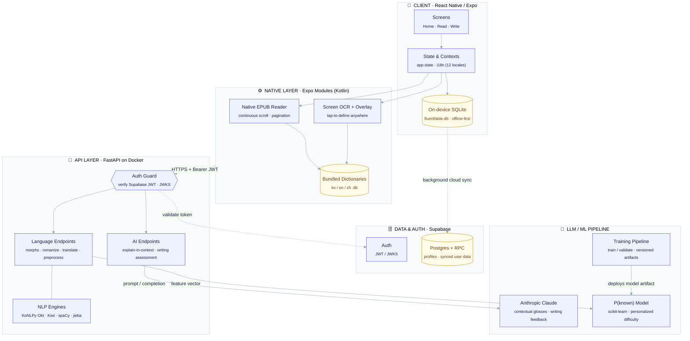

# Architecture

Noeul is an offline-first language-learning reading app. The client and a
native EPUB/OCR layer run entirely on-device; a FastAPI service handles NLP
and AI; Supabase provides auth and cloud sync; and an LLM + ML pipeline powers
contextual definitions, writing feedback, and personalized difficulty.

## Layers

| Layer | Stack | Responsibility |
|-------|-------|----------------|
| **Client** | React Native / Expo | Reading, writing, and study UI; local SQLite as the source of truth; 12-locale i18n. |
| **Native** | Expo Modules (Kotlin) | High-performance native EPUB rendering and on-screen OCR with a tap-to-define overlay; bundled offline dictionaries for zero-latency, no-network lookups. |
| **API** | FastAPI · Docker | JWT-guarded endpoints for morphological analysis, romanization, translation, chapter preprocessing, dictionary search, and AI features. Runs KoNLPy/Okt, Kiwi, spaCy, and jieba. |
| **Data & Auth** | Supabase | Auth via JWT/JWKS, and Postgres + RPC for profiles and background-synced user data. |
| **LLM / ML** | Anthropic Claude · scikit-learn | Claude generates in-context definitions and writing feedback; a versioned P(known) model personalizes word difficulty. |
